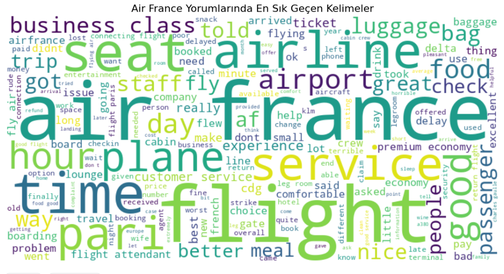

# Air France Yorumlarında Duygu Analizi (NLP Projesi)

## Proje Amacı ve Kapsamı
Bu proje, **Python ile Veri Bilimi** dersi kapsamında; metin madenciliği, veri ön işleme ve temel sınıflandırma tekniklerini uygulamalı olarak göstermek amacıyla hazırlanmış olup, **Air France** havayolu şirketine ait müşteri yorumları üzerinde duygu analizi gerçekleştirmektedir.

## Proje Hedefi
Air France müşteri yorumlarını **pozitif**, **negatif** veya **nötr** olarak sınıflandırmak ve bu sayede havayolu firmasının müşteri memnuniyeti hakkında çıkarımlar yapmak.

## Kullanılan Veri Seti
- **Kaynak:** [Kaggle - Air France Tripadvisor Reviews Dataset](https://www.kaggle.com/datasets/saharnazyaghoobpoor/air-france-reviews-dataset)
- **Boyut:** Yaklaşık 7.000 yorum
- **Sütunlar:** `rating`, `title`, `text`, `publishedDate`

## 🛠️ Kullanılan Teknolojiler
- **Programlama Dili:** Python (Jupyter Notebook)
- **Kütüphaneler:**
  - pandas  
  - scikit-learn  
  - matplotlib  
  - seaborn  
  - wordcloud

## Yöntemler

### 📝 Metin Ön İşleme
- Küçük harfe çevirme  
- Noktalama kaldırma  
- Stop word temizliği  
- Metin birleştirme (`title` + `text`)

### Özellik Çıkarımı
- **TF-IDF vektörleştirme** (maks. 1000 kelime)

### Sınıflandırma Algoritmaları
- Naive Bayes  
- Logistic Regression  
- Random Forest

### Değerlendirme Metrikleri
- Accuracy (Doğruluk)  
- Precision  
- Recall  
- F1-score

## Görselleştirmeler
### Confusion Matrix

### Puan Dağılımı

### Sentiment Dağılımı

### WordCloud

### Yorum Uzunluğu Dağılımı

### Olumlu Yorumların Kategorik Bar Grafiği

### Olumsuz Yorumların Kategorik Bar Grafiği

## Sonuçlar
- **Logistic Regression** modeli ikili sınıflandırmada en yüksek başarıyı göstermiştir.
- **Random Forest**, üç sınıflı analizde daha dengeli sonuçlar vermiştir.
- **Nadir kelimeler**, IDF değerlerine göre belirlenmiş ve analiz edilmiştir.

